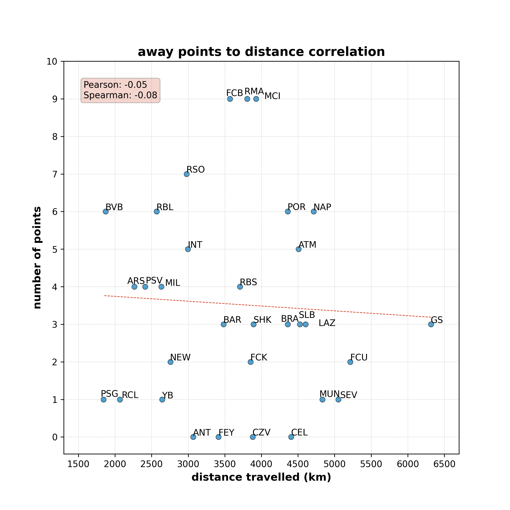

# Champions League 2023-2024: the travel effect on away teams

*does distance traveled affect away teams' performance? a data-driven investigation into the UEFA Champions League?*

---

## the big question: does long-distance travel hurt away teams' results in european tournament?

every year, clubs across europe compete in the **UEFA Champions League**, a tournament that requires not only tactical prepardness but also extensive travel. while some teams like *Paris Saint-Germain* and *Dortmund* travel barely 2,000 km for their away matches, others like *Galatasaray* and *Union Berlin* cover well above 5,000 km.

this project uses a **data-driven approach** to examine whether *long journeys* negatively impact *away teams' results* in the 2023-2024 Champions League season (group stage). using *match results* and *distance traveled*, i explore how travel affects *match outcomes*.

## what i am investigating

- how much in total does each team travel during the group stage?
- how many away points does each team score during the group stage?
- is there a correlation between traveled distance and away points scored during the group stage?

by analyzing travel distance and match statistics, i aim to uncover **hidden patterns** and **data-driven insights** into the role of travel in elite football.

---

## how to use
1. clone this repository: 
```git clone https://github.com/akbargafurov/data-analysis-vault.git```

2. install dependencies
```pip install -r requirements.txt```

3. run the analysis
```python analyse-team-performance.py```

---

## methodology: how i analysed the data

1. data acquisition
    - collected match data for all Champions League games.
    - collected stadium locations for all competing teams.
    
2. data processing
    - cleansed match and stadium data for easy analysis.
    - calculated travel distances for each away match.

3. statistical analysis & visualization
    - measured Pearson and Spearman correlation between travel distance and away teams' performance.
    - created a scatter plot to illustrate findings.

---

## key findings: the impact of travel distance on away team performance

based on the away points vs distance traveled correlation chart, we can draw the following insights:



1. weak negative correlation (**-0.05 Pearson**, **-0.08 Spearman**)
    - the correlation coefficients suggest a very weak negative relationship between travel distance and points earned in away games.

2. top-performing away teams travel both short and long distances
    - some teams like *Bayern Munich (BAR)*, *Real Madrid (RMA)*, and *Manchester City (MCI)* have achieved high away points despite varying distances, benefiting from superior logistics and squad depth.

3. teams with lower points often traveled further 
    - teams such as *Galatasaray (GS)*, *Sevilla (SEV)*, and *Celtic (CEL)* traveled longer distances and secured fewer away points.

4. squad quality matters more
    - teams like *Young Boys (YB)*, *Antwerp (ANT)*, and *Crvena Zvezda (CZV)* struggle regardless of distance, suggesting squad depth and tactics play a bigger role.

overall, while travel distance has a minor impact, stronger teams overcome it through superior logistics, squad depth, and experience in european competitions.

---

## limitations

1. limited sample size
    - this analysis only covers the 2023-2024 Champions League group stage, excluding knockout rounds and previous seasons.

2. unaccounted factors
    - squad rotation & depth, injuries, and tactical setup were not accounted for.

3. travel fatigue is hard to isolate
    - poor performance could be a result of team quality and players' form rather than the distance.

4. time zone & weather effects ignored 
    - long-distance travel often requires adapting to different climates, which were not analyzed separately.

---

## future improvements
1. expand historical analysis
    - include historical data from past UCL seasons to identify long-term trends in travel impact.

2. factor in squad strength & injuries
    - consider squad strength, team ratings, and key player injuries to see if stronger teams handle travel better. 

3. analyze weather & time zones
    - study the impact of weather conditions and time zones on away performances.

---

## acknowledgments
- match results collected from [FBref: 2023-2024 Champions League Scores & Fixtures](https://fbref.com/en/comps/8/2023-2024/schedule/2023-2024-Champions-League-Scores-and-Fixtures)
- stadium locations obtained from [World Football Net: Champions League 2023-2024](https://www.worldfootball.net/venues/champions-league-2023-2024/)
- distance calculations performed using [Geopy](https://geopy.readthedocs.io/)

---

## license
this project is licensed under the MIT License - see the [LICENSE](LICENSE) file for details.